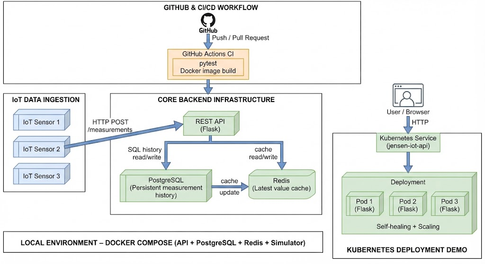

# Jensen IoT Platform – Arkitektur

## Översikt

Jensen IoT Platform är en containeriserad IoT-dataplattform där tre
simulerade IoT-sensorer skickar temperatur, luftfuktighet och batterinivå
till ett Flask-baserat REST API.

API:t validerar inkommande mätningar och lagrar historiken i PostgreSQL.
Redis används som cache för den senaste mätningen per sensor.

Den lokala miljön körs med Docker Compose. Projektet innehåller även en
GitHub Actions CI-pipeline samt en Kubernetes-demo med Deployment,
Service och tre Pod-repliker.

## Arkitekturdiagram

## Dataflöde

### IoT → REST API

De tre simulerade sensorerna skickar mätningar till:

`POST /measurements`

API:t validerar bland annat:

- `deviceId`
- temperatur
- luftfuktighet
- batterinivå

Giltiga mätningar sparas i PostgreSQL och returnerar HTTP `201`.

Ogiltiga mätningar returnerar HTTP `400`.

### REST API → PostgreSQL

PostgreSQL är den beständiga datakällan för mätningarna.

Mätningarna sparas i databasen och kan senare hämtas som historik via:

- `GET /measurements`
- `GET /devices/{id}/measurements`
- `GET /devices/{id}/latest`

PostgreSQL används eftersom historiken måste överleva om API-containern
eller Redis startas om.

### REST API ↔ Redis

Redis används som cache för den senaste mätningen.

Cache-nycklarna följer formatet:

`latest:<device_id>`

Exempel:

`latest:sensor-001`

Vid en cache hit kan API:t returnera den senaste mätningen direkt från
Redis.

Vid cache miss hämtas mätningen från PostgreSQL och läggs därefter in i
Redis.

PostgreSQL är därför den persistenta källan medan Redis används för snabb
åtkomst till ofta efterfrågad data.

## Docker Compose

Den lokala utvecklingsmiljön består av fyra tjänster:

- Flask API
- IoT simulator
- PostgreSQL
- Redis

Docker Compose används för att starta och koppla ihop tjänsterna.

PostgreSQL använder en Docker-volume för persistent lagring.

## CI/CD

GitHub Actions används för kontinuerlig integration.

Vid push eller pull request kör pipelinen:

1. Checkout av repository
2. Installation av Python 3.12
3. Installation av Python-beroenden
4. Körning av pytest
5. Byggnation av API:ts Docker-image

En grön CI-körning verifierar att testerna passerar och att Docker-imagen
kan byggas.

## Kubernetes

Kubernetes-delen demonstrerar API:t i Minikube.

Deploymenten kör tre repliker av API:t:

- Pod 1
- Pod 2
- Pod 3

En Kubernetes Service ger en gemensam åtkomstpunkt till Pod-replikerna.

### Self-healing

Om en Pod raderas upptäcker Kubernetes att antalet repliker är för lågt.
Deploymenten skapar därför automatiskt en ny Pod.

Detta demonstrerar Kubernetes self-healing.

### Scaling

Deploymenten kan skalas från tre till fem repliker och därefter tillbaka
till tre.

Det demonstrerar Kubernetes scaling.

## Viktiga arkitekturval

### PostgreSQL som persistent storage

PostgreSQL används för fullständig mätdata och historik eftersom datan
måste kunna återställas efter omstarter.

### Redis som cache

Redis används endast som cache för den senaste mätningen. Om cacheinnehållet
försvinner kan informationen hämtas från PostgreSQL igen.

### Docker Compose

Docker Compose ger en enkel lokal miljö där API, simulator, PostgreSQL
och Redis kan köras tillsammans.

### Kubernetes

Kubernetes används i projektet för att demonstrera containerorkestrering,
self-healing och scaling.

Kubernetes-demon distribuerar endast API:t enligt uppgiftens avgränsning.
PostgreSQL, Redis och simulatorn ingår inte i Kubernetes-demon.